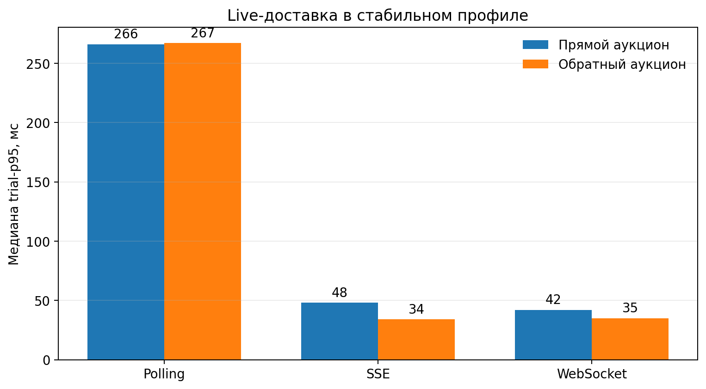
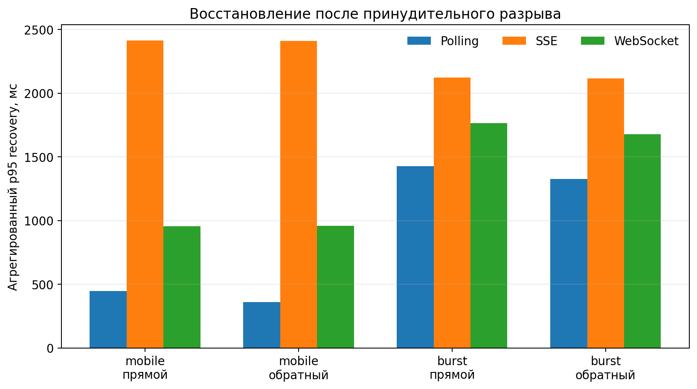
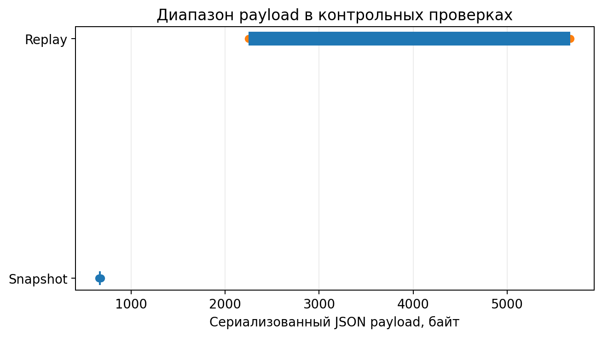
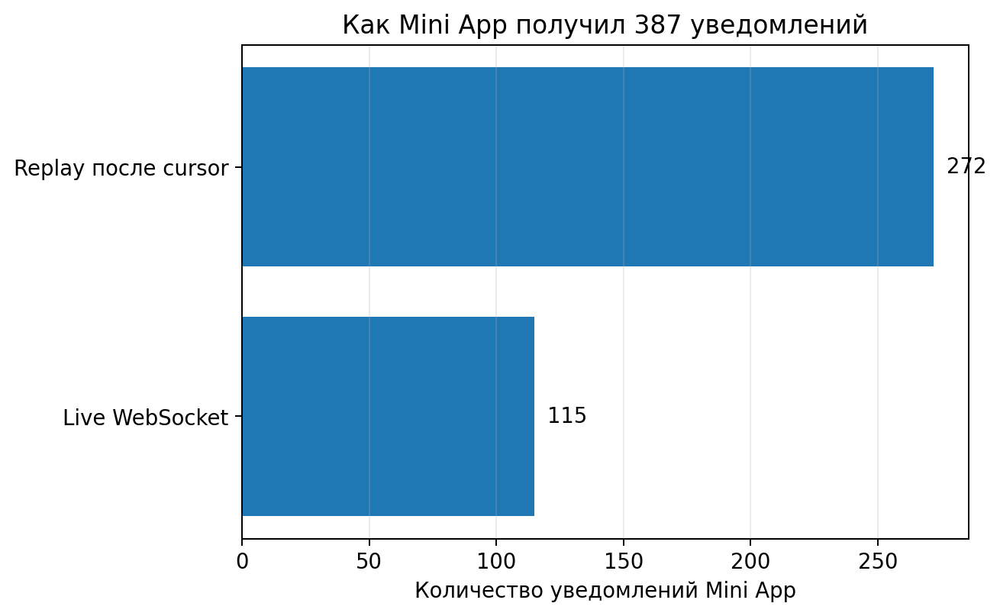

# Результаты НИР-2

Пилотная серия TeleBid проверяет пять гипотез: корректность конкурентных торгов, live-задержку транспортов, сходимость после reconnect, корректность hybrid recovery и надёжность двухканальной доставки уведомлений.

## Масштаб пилота

  
<strong>18 / 18</strong>торгов завершились с корректной ценой и лидером

  
<strong>64 / 64</strong>повторные команды распознаны без второго эффекта

  
<strong>306 / 306</strong>клиентов сошлись с серверной версией после reconnect

  
<strong>7041</strong>наблюдение доставки событий

  
<strong>1125 / 1125</strong>Telegram-уведомлений доставлены после fail первой попытки

  
<strong>387 / 387</strong>ожидаемых уведомлений получил Mini App

Финальная серия включала три профиля нагрузки, два вида аукциона и три повтора. Генератор отправил 1008 исходных команд и 64 намеренных retry; 369 исходных команд были приняты, 639 корректно отклонены после проверки актуальной цены.

## Формальная модель измерений

Ключевые свойства эксперимента зафиксированы не только текстовыми проверками, но и формальными условиями.

<b>Задержка доставки события</b>
<math display="block"><mrow><msub><mi>L</mi><mrow><mi>i</mi><mo>,</mo><mi>e</mi></mrow></msub><mo>=</mo><msubsup><mi>t</mi><mtext>receive</mtext><mrow><mi>i</mi><mo>,</mo><mi>e</mi></mrow></msubsup><mo>−</mo><msubsup><mi>t</mi><mtext>server</mtext><mi>e</mi></msubsup></mrow></math>
<small>Из неё считаются median и p95.</small>

<b>Условие сходимости</b>
<math display="block"><mrow><msubsup><mi>v</mi><mi>i</mi><mtext>final</mtext></msubsup><mo>=</mo><msubsup><mi>v</mi><mtext>server</mtext><mtext>final</mtext></msubsup><mo>,</mo><mspace width="1em"/><mi>missingEvents</mi><mo>=</mo><mn>0</mn></mrow></math>
<small>Финальная версия клиента должна совпасть с серверной.</small>

<b>Идемпотентность команды</b>
<math display="block"><mrow><mi>effects</mi><mo>(</mo><mi>auctionId</mi><mo>,</mo><mi>commandId</mi><mo>)</mo><mo>≤</mo><mn>1</mn></mrow></math>
<small>Повтор команды не создаёт второй доменный эффект.</small>

<b>Политика hybrid recovery</b>
<math display="block"><mrow><mi>mode</mi><mo>=</mo><mi>argmin</mi><mo>{</mo><mo>|</mo><mi>JSON</mi><mo>(</mo><mi>snapshot</mi><mo>)</mo><mo>|</mo><mo>,</mo><mo>|</mo><mi>JSON</mi><mo>(</mo><mi>replay</mi><mo>)</mo><mo>|</mo><mo>}</mo></mrow></math>
<small>При условии непрерывности replay выбирается меньший корректный payload.</small>

Формулы представлены нативным **MathML**. Поэтому критичные математические блоки не зависят от внешнего MathJax/KaTeX CDN и продолжают отображаться при отключённой внешней сети.

## H1 · Корректность конкурентных торгов

Во всех 18 trial фактическая цена и лидер совпали с ожидаемым лучшим предложением. Авторитетные версии журнала были непрерывны, а все 64 повторные команды вернули сохранённый результат с признаком идемпотентного replay. Повторных доменных эффектов не зафиксировано.

  
<b>49,31 мс</b>среднее время обработки исходной команды

  
<b>40 мс</b>медиана

  
<b>114 мс</b>p95

  
<b>438 мс</b>максимум

**Вывод:** транзакционная обработка, `SELECT FOR UPDATE` и составной ключ идемпотентности `(auctionId, commandId)` обеспечили корректность в исследованном диапазоне.

## H2 · Live latency: Polling vs SSE vs WebSocket

В стабильном профиле SSE и WebSocket показали заметно меньшую p95-задержку live-доставки, чем HTTP polling.

| Вид торгов | Polling | SSE | WebSocket |
|---|---:|---:|---:|
| Прямой | 266 мс | 48 мс | **42 мс** |
| Обратный | 267 мс | **34 мс** | 35 мс |

По трём повторам нельзя объявлять SSE или WebSocket универсальным победителем: преимущество между ними мало и меняет направление между видами торгов.

## H3 · Восстановление после разрыва

После reconnect все 306 клиентов завершили серию на актуальной серверной версии. `staleClients = 0`, `missingEvents = 0`. Гипотеза поддержана во всех 12 trial с разрывом.

| Профиль | Polling | SSE | WebSocket |
|---|---:|---:|---:|
| mobile-reconnect, прямой | **446 мс** | 2415 мс | 954 мс |
| mobile-reconnect, обратный | **360 мс** | 2409 мс | 960 мс |
| final-burst-unstable, прямой | **1427 мс** | 2121 мс | 1766 мс |
| final-burst-unstable, обратный | **1328 мс** | 2116 мс | 1678 мс |

<b>Неожиданный результат:</b> при принудительном fault polling в текущей конфигурации восстанавливался быстрее push-вариантов. Это не противоречит H2: live latency и reconnect — разные свойства системы.

## H4 · Hybrid recovery

Во всех 18 контрольных проверках snapshot, replay и hybrid пришли к одной финальной версии, а replay содержал непрерывный диапазон событий.

  
<small>Snapshot</small><strong>657–676 байт</strong>

  
<small>Replay</small><strong>2250–5675 байт</strong>

  
<small>Hybrid</small><strong>18 / 18 → snapshot</strong>

Hybrid корректно выбрал меньший сериализованный JSON payload. При этом однообразный выбор — ограничение пилота: состояние аукциона было небольшим, поэтому из результата нельзя делать вывод, что snapshot всегда лучше replay.

## H5 · Mini App и Telegram-уведомления

Система сохранила 1125 уведомлений. Исследовательский адаптер намеренно отклонял первую попытку каждого сообщения. После retry все 1125 записей получили статус `DELIVERED`.

- trial-p95 доставки ботом: **115–469 мс**;
- Mini App получил **387 из 387** ожидаемых уведомлений;
- **115** пришли через live WebSocket;
- **272** восстановлены через replay после cursor;
- потерь, повторного показа и нарушений причинного порядка не обнаружено.

Для retry использовалась экспоненциальная задержка. Упрощённая модель:

<math display="block"><mrow><msub><mi>d</mi><mi>k</mi></msub><mo>=</mo><mi>min</mi><mo>(</mo><msub><mi>d</mi><mtext>max</mtext></msub><mo>,</mo><msub><mi>d</mi><mn>0</mn></msub><mo>·</mo><msup><mn>2</mn><mi>k</mi></msup><mo>)</mo></mrow></math>

## Дефект, который обнаружил пилот

Первый полный запуск показал важную проблему: один polling-клиент достиг финальной версии, но в его локальной истории не было четырёх промежуточных событий. Причина оказалась не в polling, а в recovery endpoint: snapshot и журнал событий читались параллельно и могли относиться к разным точкам времени.

Исправление: сервер сначала фиксирует snapshot, затем загружает журнал и отбрасывает события выше `snapshot.version`. После исправления серия из 18 trial была повторена; в финальном датасете итоговые пропуски равны нулю.

## Главный вывод НИР-2

Пилот поддержал H1–H5 **в тестируемом диапазоне**, но не является универсальным доказательством превосходства одного транспорта.

> **Транспорт доставки нельзя оценивать отдельно от серверной семантики и recovery.** Корректность торгов задают транзакции, идемпотентность и версионированный журнал. Polling/SSE/WebSocket в первую очередь влияют на live latency, а сходимость после разрыва определяется snapshot/replay-протоколом.
