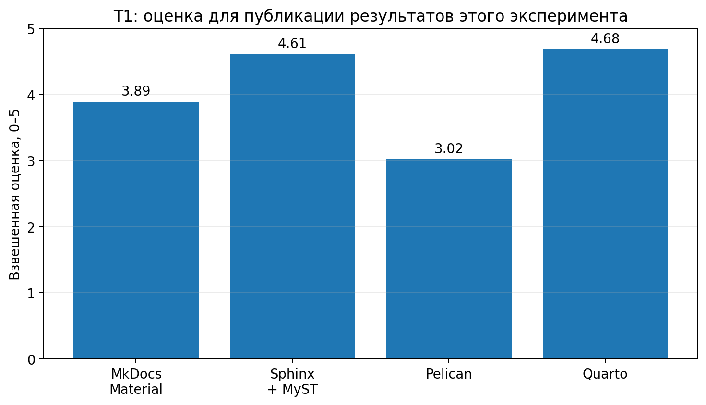

# T1 · Сравнительный анализ генераторов статических сайтов

<div class="page-intro">
Сравниваются четыре генератора: <b>MkDocs + Material</b>, <b>Sphinx + MyST-Parser</b>, <b>Pelican</b> и <b>Quarto</b>. Цель матрицы — не выбрать «лучший SSG вообще», а определить наиболее подходящий инструмент для публикации результатов воспроизводимого веб-эксперимента TeleBid.
</div>

## Метод оценки

Использована шкала **1–5**:

- **5** — функция является сильной стороной инструмента и поддерживается напрямую;
- **4** — хорошо поддерживается штатным расширением или стандартным экосистемным решением;
- **3** — реализуемо, но требует дополнительного плагина, шаблона или ручной настройки;
- **2** — возможно с заметными ограничениями или обходными решениями;
- **1** — не является типичным сценарием применения.

Оценки ниже — **прикладная экспертная матрица для этой лабораторной**, а не универсальный benchmark. Абсолютное время сборки не приводится, потому что оно зависит от числа страниц, темы, плагинов, вычислительного контента и hardware runner. Для эксплуатационного сравнения учитывается типичная архитектура сборки, наличие cache/incremental-механизмов и сложность зависимостей.

## Веса критериев для нашей задачи

<div class="weight-grid">
  <div><strong>50%</strong><span>Научный контент</span><small>формулы, ссылки, рисунки, библиография, воспроизводимые результаты</small></div>
  <div><strong>20%</strong><span>Вёрстка</span><small>адаптивность, карточки, шаблоны, HTML/PDF</small></div>
  <div><strong>30%</strong><span>Эксплуатация</span><small>поиск, i18n, расширяемость, CI, версии, зрелость</small></div>
</div>

Для TeleBid научный контент имеет наибольший вес: сайт должен публиковать результаты эксперимента, графики, формулы, перекрёстные ссылки и в дальнейшем может быть связан с API-документацией стенда. Внешний вид важен, но вторичен относительно воспроизводимости и структуры исследования.

## 1. Представление научного контента

| Критерий | MkDocs + Material | Sphinx + MyST | Pelican | Quarto |
|---|:---:|:---:|:---:|:---:|
| Markdown / reST / MyST / ipynb / qmd | 4 | **5** | 3 | **5** |
| LaTeX-формулы, нумерация и ссылки | 3 | **5** | 2 | **5** |
| Рисунки, подписи, автонумерация, cross-ref | 3 | **5** | 2 | **5** |
| Таблицы, CSV/DataFrame | 3 | **5** | 3 | **5** |
| Интерактивные Plotly/Bokeh/Altair | 3 | 4 | 3 | **5** |
| Исполняемый контент и cache | 2 | 3 | 2 | **5** |
| BibTeX и стили цитирования | 3 | **5** | 3 | **5** |
| Сноски, глоссарий, обозначения, нумерация | 3 | **5** | 2 | **5** |

### Комментарии

**MkDocs + Material.** Material предоставляет удобные Markdown-компоненты, grids/cards, локальный поиск и интеграцию MathJax/KaTeX. Однако развитая научная семантика — сквозные ссылки на формулы, библиография, автоматическая нумерация сложных объектов — чаще собирается из расширений. Документация Material прямо показывает интеграцию MathJax/KaTeX, а grids/cards являются штатной частью темы.

**Sphinx + MyST.** Sphinx изначально проектировался как система структурированной технической документации: поддерживает ссылки на секции, рисунки, таблицы, формулы, citations, glossary и кодовые объекты; умеет собирать HTML и LaTeX/PDF. MyST-Parser добавляет Markdown-синтаксис поверх объектной модели Sphinx. Формулы могут нумероваться и ссылаться через встроенную math-инфраструктуру.

**Pelican.** Сильнее всего Pelican выглядит как Python-движок публикации статей/страниц и блогов. Он поддерживает Markdown и reStructuredText, Jinja2-темы, плагины и cache. Но научные cross-reference, формулы, библиография и исполняемые ноутбуки не являются его центральной моделью и требуют дополнительной сборки.

**Quarto.** Самый сильный вариант для computational publishing: `.qmd`, `.ipynb`, Jupyter/Knitr, code execution, Jupyter Cache, cross-reference для figures/tables/equations, citations и множество выходных форматов. Если бы главной задачей было автоматически исполнять ноутбуки и из одного источника получать HTML+PDF+DOCX, Quarto получил бы преимущество.

## 2. Вёрстка и шаблоны

| Критерий | MkDocs + Material | Sphinx + MyST | Pelican | Quarto |
|---|:---:|:---:|:---:|:---:|
| Grid/cards и адаптивность | **5** | 4 | 3 | **5** |
| Готовые layout и темы | **5** | 4 | 4 | **5** |
| Собственный Jinja2/template override | **5** | **5** | **5** | 4 |
| Частичное переопределение темы | **5** | **5** | 4 | 4 |
| HTML + PDF/LaTeX из одного источника | 2 | **5** | 2 | **5** |
| Печатное представление | 3 | **5** | 2 | **5** |

Material особенно удобен для красивого документационного интерфейса без большого количества собственного CSS. Sphinx имеет широкую систему тем и builders, а Quarto — развитые layout и multi-format output. Pelican максимально гибок на уровне Jinja2, но готовую исследовательскую семантику приходится конструировать самостоятельно.

## 3. Эксплуатационные характеристики

| Критерий | MkDocs + Material | Sphinx + MyST | Pelican | Quarto |
|---|:---:|:---:|:---:|:---:|
| Версионирование документации | 4 | **5** | 3 | 3 |
| Локальный поиск | **5** | 4 | 2 | 4 |
| Русскоязычный поиск | 4 | 3 | 2 | 3 |
| i18n | 4 | **5** | 4 | 4 |
| Autodoc из docstrings | 2 | **5** | 2 | 2 |
| Плагины / хуки / directives | 4 | **5** | 4 | 4 |
| Холодная сборка для текстового сайта | **5** | 4 | **5** | 3 |
| Инкрементальная/cached сборка | 4 | **5** | 4 | **5** |
| Простота Python-only CI | **5** | **5** | **5** | 3 |
| Зрелость и активная экосистема | **5** | **5** | 4 | **5** |

### Поиск и русский язык

Material использует локальный поисковый индекс; документация позволяет задавать язык и подключает language-specific stemmers. Это делает его особенно удобным для русскоязычной документации без внешнего поискового сервиса. У Sphinx локальный поиск встроен в HTML builder, но качество морфологии зависит от выбранной темы/индекса и обычно менее заметно настраивается «из коробки».

### Сборка

Для текстового документационного сайта MkDocs и Pelican обычно имеют небольшой pipeline. Sphinx выполняет более богатый анализ doctree и ссылок, зато умеет сохранять окружение сборки и хорошо работает с инкрементальными перестроениями. Quarto при чистом Markdown остаётся приемлемым, но computational-сценарий добавляет Jupyter/Pandoc/движки и может резко увеличить cold build; это компенсируется `cache` и `freeze`.

## Итоговая модель



Категориальная модель использует веса 50/20/30%. Она не претендует на универсальность, а отвечает на вопрос: **что удобнее именно для текущего research-site TeleBid?**

| Генератор | Научный контент | Вёрстка | Эксплуатация | Взвешенно |
|---|---:|---:|---:|---:|
| MkDocs + Material | 3.4 | **4.8** | 4.1 | 3.89 |
| **Sphinx + MyST** | **4.7** | 4.1 | **4.8** | **4.61** |
| Pelican | 2.4 | 3.7 | 3.6 | 3.02 |
| Quarto | **5.0** | 4.6 | 4.2 | 4.68 |

```{note}
По чистой численной модели Quarto немного выше Sphinx из-за исполняемых notebook и multi-format. Для **фактической реализации этой лабораторной** выбран Sphinx, потому что текущий контент уже является структурированной технической документацией, нужен Python-only CI, строгие cross-reference и потенциальный autodoc к TypeScript/Python-инструментам важнее автоматического исполнения notebook. Разница между двумя кандидатами небольшая и определяется весами.
```

## Почему в проекте оставлен Sphinx

Для текущей версии сайта Sphinx + MyST выбран по следующим причинам:

1. Исследование состоит преимущественно из структурированного текста, результатов, таблиц, схем и cross-reference, а не из notebook-first анализа.
2. Sphinx имеет строгую модель ссылок и предупреждений, что хорошо сочетается с `sphinx-build -W` в CI.
3. Один источник может собираться в HTML и LaTeX/PDF.
4. Есть встроенная инфраструктура autodoc/i18n и богатая система расширений.
5. В GitHub Actions достаточно обычной Python-среды и `pip install -r requirements.txt`.
6. MyST сохраняет удобство Markdown, поэтому исходники читаемы прямо в GitHub.

## Когда выбор меняется

- **Quarto** — если результаты эксперимента будут жить в Jupyter notebooks, графики должны вычисляться при build, а один источник требуется публиковать одновременно в HTML/PDF/DOCX.
- **MkDocs + Material** — если основная цель смещается к красивой продуктовой документации и максимально простому/быстрому сайту, а сложные научные cross-reference вторичны.
- **Pelican** — если ресурс превращается прежде всего в журнал статей/новостей/блог с датами, авторами, тегами, RSS и полностью кастомной Jinja2-темой.

## Источники для матрицы

Матрица сверена с официальной документацией проектов:

- Material for MkDocs: grids, search, math и theme overrides — `https://squidfunk.github.io/mkdocs-material/`;
- Sphinx: cross-references, math, builders, autodoc и i18n — `https://www.sphinx-doc.org/`;
- MyST-Parser — `https://myst-parser.readthedocs.io/`;
- Pelican: content formats, Jinja2 themes, plugins и cache — `https://docs.getpelican.com/`;
- Quarto: cross-references, computations, cache/freeze и output formats — `https://quarto.org/docs/`.
